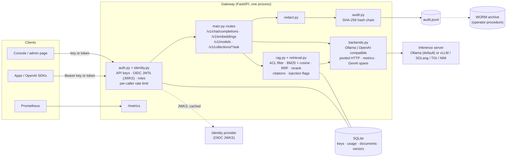

# Private LLM Platform

[](https://github.com/coreymathie/private-llm-platform/actions/workflows/ci.yml)


**A reference implementation of a self-hosted generative AI platform for regulated institutions: an
OpenAI-compatible gateway that places identity, permission-aware retrieval, audit evidence and model governance
outside the model, in front of a private inference server.**

## At a glance

| | |
|---|---|
| **Problem** | Regulated teams can't send prompts or documents to a public API, and a bare model server has no identity, limits, access control or audit trail. |
| **Architecture** | One FastAPI gateway (OpenAI-compatible API) in front of Ollama or any OpenAI-compatible server (vLLM, SGLang, TGI, NVIDIA NIM). SQLite for keys, documents and vectors; a hash-chained JSONL audit log. |
| **Key decisions** | Pluggable inference backend; on-host embeddings with hybrid BM25 + vector retrieval; OIDC tokens alongside API keys; envelope encryption; pinned model digests. Each recorded as an ADR with its trade-off. |
| **Controls** | API keys and OIDC SSO with group roles; collection and document access lists applied before scoring; rate limits; PII redaction; SHA-256 audit chain; model lock file with an off/warn/enforce policy and a CycloneDX ML-BOM. |
| **Evidence** | 230 automated tests; a RAG eval gate in CI with 0 ACL leaks; hybrid citation accuracy 0.837 → 0.884 on the golden set; a 41-check headless browser smoke test across both console modes; 8 ADRs. |
| **Out of scope** | SCIM provisioning, ACL sync from source systems, a KMS key provider, model signature verification and multi-replica operation are roadmap items. No model-serving benchmarks are published. |
| **Try it** | [Live console](https://coreymathie.github.io/private-llm-platform/demo/): the gateway's real Python modules in your browser through Pyodide. Locally, `docker compose up` needs no model or GPU. |

## Live demo

**[Open the live console](https://coreymathie.github.io/private-llm-platform/demo/)**


The console is set in **Cypress Harbor Credit Union**, a *fictional* credit union, and opens on Harbor
Assistant, the staff-facing chat. A visitor can ask as different employees and see access decided before
retrieval, open cited sources, verify and tamper with the audit chain, change the access policy, and pin
models. The gateway's real Python modules run in the browser through Pyodide against **simulated** services;
there is no LLM in the browser, and all business data is a **sample**. How the console works, including its
live mode against a running gateway: [docs/console.md](docs/console.md).

## Problem and context

Running a model locally is no longer the hard part. Letting *other people and applications* use it safely is.
A model server port has no authentication, no per-application identity, no limits, no record of who asked
what, and no way to show an auditor that the record was not edited. Document Q&A raises two further questions:
*which documents did this answer rely on*, and *what happens when a document contains instructions*?

For a credit union the constraints are concrete:

- **Need-to-know access.** HR compensation bands, BSA/AML escalation procedures and payments runbooks sit next
  to branch procedures in the same knowledge base. An HR employee and an engineer asking the same question must
  get different answers, and hidden documents must not leak through citations, counts or error messages.
- **Evidence.** Examiners and internal audit expect an attributable record of every access decision and a way
  to verify that it is complete and unaltered.
- **Data residency.** Member data and internal procedures stay on infrastructure the institution controls, often
  a single on-prem GPU server, sometimes with no internet access.
- **Model governance.** The institution must be able to say which model, at which exact version, produced an
  answer.

The access and evidence model follows patterns from card-fraud and dispute operations: need-to-know access to
case material, an attributable record of every decision, and evidence that holds up when someone checks it
independently.

## Reference architecture



**Components.** The gateway is the single enforcement point. `auth.py` and `identity.py` authenticate API keys
and OIDC tokens and apply per-caller rate limits; `rag.py` and `retrieval.py` decide access, rank passages and
track citations; `backends.py` adapts to Ollama or any OpenAI-compatible server behind one interface;
`audit.py` and `redact.py` write the evidence. State is one SQLite file and one append-only JSONL log.

**Trust boundaries.** Client → gateway (prompts, documents, credentials; bound to `127.0.0.1:8080` by default,
remote access through a TLS reverse proxy); gateway → identity provider (public signing keys only); gateway →
inference server (prompts and admitted passages, never the caller's key); gateway → disk (keys, documents,
vectors, audit entries, optionally encrypted); scraper → `/metrics` (labels only, never prompt text). Details:
[docs/threat-model.md](docs/threat-model.md).

**Data flow.** A chat request is authenticated against SQLite (or the IdP's cached JWKS) and the per-caller
sliding-window limiter, mapped to the configured backend, and mapped back to the OpenAI format (including SSE
streams); usage is counted per key, and, if enabled, the prompt and answer are redacted and appended to the
hash chain. A document question adds the access decision, hybrid retrieval over admitted passages only, a
prompt that treats passages as data, citation tracking, injection flags, and an always-on audit entry listing
the passages used. Retrieval and the request contract: [docs/document-qa.md](docs/document-qa.md).

## Design principles

1. **Controls live outside the model.** Authentication, authorization, limits and audit are enforced by the
   gateway; the model holds no secrets, tools or access rules.
2. **Decide access before retrieval.** Unreadable documents are filtered in SQL before scoring, so they never
   reach ranking, the prompt, citations, flags or counts.
3. **Fail closed.** Unknown models under `enforce`, missing encryption keys, unreachable identity providers and
   altered backups all refuse service rather than degrade silently.
4. **Evidence by default.** Admin actions and every document question are logged and hash-chained regardless of
   prompt-logging settings; each control points at a test.
5. **Least privilege and separation of duties.** Readers cannot use raw chat, only admins change documents and
   access lists, the last admin cannot be revoked, and backups never contain keys.
6. **State limits honestly.** Every number is labelled **measured**, **simulated** or **sample**, and every gap
   is listed as residual risk or roadmap.

## Key decisions and trade-offs

| ADR | Decision | Trade-off accepted |
|---|---|---|
| [0001](docs/adr/0001-inference-backend.md) | Ollama by default; any OpenAI-compatible server (vLLM, SGLang, TGI, NIM) as a pluggable, instrumented backend with an unchanged gateway API | Chat and embeddings share one base URL; compatibility tested against mocked HTTP, not live servers |
| [0002](docs/adr/0002-local-embeddings-on-host-vector-store.md) | Local embeddings, vectors in the gateway's SQLite file, exact cosine search | Every question scores every readable passage; ANN index deferred until scale demands it |
| [0003](docs/adr/0003-audit-log-hash-chain-vs-worm.md) | Hash-chained JSONL log on the host for tamper evidence, WORM storage for retention | The newest entries are protected only by the WORM copy; entries are not signed |
| [0004](docs/adr/0004-prompt-injection-defense-in-depth.md) | Prompt-injection guard as defense in depth (prompt separation, heuristic flags, no tools or secrets in context, curated sources), not a fix | A model can still follow injected text; flags are bypassable by paraphrase |
| [0005](docs/adr/0005-oidc-identity-and-roles.md) | OIDC access tokens verified locally against the IdP's JWKS, alongside API keys; roles (admin, user, reader:&lt;collection&gt;) from IdP groups | Token lifetime is the revocation delay; no login flow or SCIM |
| [0006](docs/adr/0006-hybrid-retrieval-and-rag-evals.md) | Hybrid BM25 + vector retrieval fused with Reciprocal Rank Fusion, pluggable reranker, RAG eval gate in CI | BM25 tokenizes candidates per question; the eval uses a stand-in embedder |
| [0007](docs/adr/0007-envelope-encryption-at-rest.md) | Envelope encryption for passages, vectors and audit text with a pluggable key provider; keys never in backups | Titles, access lists and API keys stay readable; about 40–50 ms more per question at 3,883 passages |
| [0008](docs/adr/0008-model-pinning-and-ml-bom.md) | Pinned model digests verified against what is served, off/warn/enforce policy, CycloneDX ML-BOM | Integrity against the pin, not provenance; pins are trust on first use |

## Controls and risk mapping

| Control | Risk addressed | Enforcement point | Evidence |
|---|---|---|---|
| One API key per application or an OIDC token per person (RS256/ES256 allow-list, JWKS with rotation, `iss`/`aud`/`exp` checks) | Spoofed callers; forged tokens, `alg: none`, HMAC confusion | `gateway/auth.py`, `gateway/identity.py` | `test_identity.py::test_algorithm_allow_list_blocks_none_hmac_confusion_and_other_algs` |
| Roles `admin`, `user`, `reader:<collection>` from IdP groups; admin-only key, document and model routes; last-admin guard | Privilege escalation; admin lockout | `gateway/identity.py`, `gateway/main.py` | `test_identity.py::test_reader_role_is_limited_to_its_collection`; `test_gateway.py::test_cannot_revoke_last_admin` |
| Collection and document access lists (`group:`, `key:`, `user:`) applied in SQL before scoring; denials audited | Cross-group disclosure through answers, citations, flags or counts (OWASP LLM08) | `gateway/rag.py::access_for`, `gateway/rag.py::candidates` | `test_acl.py::test_no_cross_group_leakage_in_answers_citations_flags_counts_or_prompts`; 0 ACL leaks in the eval |
| Per-key sliding-window rate limit (429); upload size limit; `top_k` and batch caps | Abuse, noisy neighbours, unbounded consumption (LLM10) | `gateway/auth.py`, `gateway/main.py` | `test_gateway.py::test_rate_limit` |
| SHA-256 hash-chained log of admin actions, document changes and every document question; `verify()` reports the first tampered line | Repudiation; evidence tampering | `gateway/audit.py` | `test_gateway.py::test_audit_verify_detects_tampering` |
| Prompt logging off by default; redaction of SSNs, Luhn-valid cards, DOBs, emails, US phones; optional AES-256-GCM sealing of audit text | PII in logs | `gateway/redact.py`, `gateway/crypto.py` | `test_redact.py`; `test_encryption.py::test_audit_text_fields_are_sealed_and_the_chain_verifies_without_keys` |
| Envelope encryption (a data key per document, wrapped by a rotatable key-encryption key) for passages and vectors | Disclosure from a copied database or backup | `gateway/crypto.py`, `scripts/keys.py` | `test_encryption.py::test_passages_and_vectors_are_sealed_on_disk_and_readable_through_the_api` |
| Online backup with checksummed manifest; restore verifies checksums, integrity, the audit chain and key availability first | Data loss; restoring altered backups | `scripts/backup.py`, `scripts/restore.py` | `test_backup_restore.py::test_backup_restore_drill_brings_back_documents_keys_acls_and_the_audit_chain` |
| Passages as numbered data; system prompt says to ignore instructions in them; suspicious passages flagged in response and audit | Indirect prompt injection (LLM01) | `gateway/rag.py` | `test_injection_flags.py`; `test_documents.py::test_ask_retrieves_the_right_document_and_cites_it` |
| Lock file of pinned model digests verified at startup, after pulls, on demand and on an interval; `warn` or `enforce` (403); CycloneDX 1.6 ML-BOM | Swapped or re-pulled model (LLM03) | `gateway/supply_chain.py`, `scripts/mlbom.py` | `test_supply_chain.py::test_enforce_serves_only_pinned_models_whose_digest_matches` |
| No outbound calls except the configured inference server; caller keys never forwarded; no prompt text in metrics or traces | Data egress; telemetry leakage | `gateway/backends.py`, `gateway/telemetry.py` | `test_backends.py::test_no_upstream_key_means_no_authorization_header`; `test_telemetry.py::test_chat_emits_genai_span` |

Framework mappings, each row with its code and test: [docs/controls.md](docs/controls.md) (HIPAA 45 CFR
164.312(a)–(e), SOC 2 CC6/CC7, NIST AI RMF and NIST AI 600-1, ISO/IEC 42001 Annex A, with gaps marked as
roadmap) and [docs/threat-model.md](docs/threat-model.md) (STRIDE and the OWASP Top 10 for LLM Applications
(2025), each with a control, a test and the residual risk). Operating procedures, audit events and WORM
retention: [docs/compliance.md](docs/compliance.md). Identity and the access decision:
[docs/identity.md](docs/identity.md). These are engineering mappings that support a compliance program, not
certifications.

## Evaluation and evidence

**Tests.** 230 automated tests, all passing, run in CI with lint, format, `shellcheck` and `helm lint`; upstream
HTTP is mocked for both backend wire formats, and the docs are tested so that every referenced test and code
symbol exists. Coverage by file: [docs/testing.md](docs/testing.md).

### Quality

**RAG eval gate (measured).** `scripts/rag_eval.py --check` runs the real ingestion, access-control and retrieval
code over a bundled golden set (12 fictional documents, 2 of them restricted, 43 questions) and fails CI on a
drop below `evals/thresholds.json` or any ACL leak. Measured at k=4 with the demo's hashed bag-of-words embedder
(not a neural model) and extractive answerer (no LLM), so it is a regression baseline rather than a quality
claim ([ADR 0006](docs/adr/0006-hybrid-retrieval-and-rag-evals.md)):

| Configuration | recall@1 | recall@4 | MRR | citation accuracy | answer contains | ACL leaks |
|---|---:|---:|---:|---:|---:|---:|
| `vector+none` | 0.907 | 0.977 | 0.942 | 0.907 | 0.954 | 0 |
| `bm25+none` | 1.000 | 1.000 | 1.000 | 0.907 | 0.977 | 0 |
| `hybrid+none` | 0.954 | 1.000 | 0.977 | 0.884 | 0.977 | 0 |
| `hybrid+lexical` | 1.000 | 1.000 | 1.000 | 0.907 | 0.954 | 0 |

### Benchmarks

**Gateway overhead (measured).** Against a stub upstream that streams 64 tokens instantly (2 vCPUs shared by
client, gateway and stub; one uvicorn worker):

| Concurrency | Direct to stub, p50 | Through gateway, p50 | Gateway throughput |
|---:|---:|---:|---:|
| 1 | 3.5 ms | 9.2 ms | 102 req/s |
| 8 | 25.5 ms | 68.2 ms | 112 req/s |
| 32 | 86.5 ms | 292.6 ms | 106 req/s |

That measurement found a real bottleneck: building an HTTP client per upstream call cost about 48 ms of blocking
CPU and capped the gateway at about 17 req/s. v0.5 pools one client per event loop (about 6x throughput on the
same host). **No model-serving numbers are published**: the build environment could not download model
weights, so [docs/benchmarks.md](docs/benchmarks.md) provides a method, a results template and
`scripts/loadtest.py` instead of estimates.

**Storage (measured).** Encryption at rest and backup/restore time on a synthetic 3,883-passage collection:
[docs/operations.md](docs/operations.md#encryption-at-rest) (`scripts/bench_storage.py`).

**Console (measured).** `scripts/demo_smoke.py` drives the real console headlessly in both modes: 41 checks, no
console errors, no horizontal scroll at 390 px.

## Operations

- **Observability.** Prometheus `/metrics` (requests, latency, TTFT, tokens and backend errors, labelled by key
  *label*, never the secret), a Grafana dashboard, and OpenTelemetry GenAI spans with no prompt text.
- **Failure behaviour.** An unreachable inference server returns 502 before any stream starts; an unreachable
  IdP keeps cached keys for one cache period, then returns 503; unpinned or mismatched models are refused under
  `enforce`; decryption failures return 500 rather than plaintext; restores refuse altered backups.
- **Deployment options.** One-line installers for macOS, Linux and Windows; Docker Compose (simulated backend,
  Ollama or vLLM profiles); a Helm chart with a hardened single-replica gateway, default-deny NetworkPolicy and
  optional vLLM on NVIDIA GPUs; an air-gap bundle with checksums.
- **Recovery.** Verified backup and restore with RTO/RPO guidance and a drill procedure.

Details: [docs/operations.md](docs/operations.md) (observability, full failure-mode tables, encryption, keys,
backup, restore, model pinning), [docs/configuration.md](docs/configuration.md),
[docs/kubernetes.md](docs/kubernetes.md), [docs/enterprise-notes.md](docs/enterprise-notes.md).

## Limitations and residual risk

- **Identity.** No SCIM provisioning and no login flow in the admin page (it accepts a pasted token); a stolen,
  unexpired token works until it expires; API keys do not expire and are stored unhashed in SQLite.
- **Access lists** are set by admins, not synced from source systems, and are only as accurate as the admin and
  the IdP's groups. Admins read everything.
- **Audit tail.** The newest audit entries can be rewritten undetected until compared with the WORM archive; no
  signed checkpoints.
- **Prompt injection.** A model can still follow injected text, and a poisoned document's false claims can be
  cited. No guard model ships.
- **Model provenance.** Digests are pinned and checked; signatures are not verified.
- **Encryption scope.** Opt-in; titles, access lists and API keys stay readable; only a local keyring ships.
- **Scale.** One gateway process per host (in-memory rate limits, process-local audit writer); exact search
  and per-question BM25 tokenization.
- **Validation gaps.** Answer faithfulness with a real model is not evaluated; the cross-encoder reranker,
  export to a live OTel collector, and live vLLM/SGLang/TGI/NIM servers are untested here; the Helm chart is
  validated by schema checks and a template-rendering harness, not by `helm install` on a cluster.

## Roadmap

**Phase 2** (remaining items):

- **Identity:** SCIM provisioning, an authorization-code + PKCE login in the admin page, and token
  introspection for immediate revocation (OIDC token validation and group roles shipped in 0.6).
- **Access lists synced from source systems** (SharePoint, Drive, file shares) instead of set by admins.
- **Retrieval quality:** a validated cross-encoder reranker, ANN and full-text indexes for large collections,
  and LLM-judged faithfulness evals against a deployment's own model (hybrid retrieval, the lexical reranker and
  the CI eval gate shipped in 0.6).
- **Packaging:** a published, signed gateway image; horizontal scaling (Postgres and a shared rate-limit store)
  so the chart can run more than one replica (Helm chart and air-gap bundle shipped in 0.6).
- **Supply chain:** model signature verification (Sigstore model signing, OCI signatures) on top of the digest
  pinning and ML-BOM shipped in 0.6, and a dependency lock file with hashes.
- **Data protection:** a KMS key provider (AWS KMS, Key Vault, Vault Transit), hashed API keys, and scheduled
  off-host backups (encryption at rest, key rotation and verified backup/restore shipped in 0.6).

Also tracked: a separate embeddings endpoint for `openai_compatible`, token budgets per key, a shared rate-limit
store for multi-process deployments, signed audit checkpoints, and published model-serving benchmarks on real
hardware.

## Getting started

### Quickstart

Run the console and gateway with a simulated backend (no model or GPU required):

```bash
docker compose up        # then open http://localhost:8080/console/
docker compose logs gateway | grep "Bootstrap admin"     # the admin key to paste on Settings
```

Run the gateway from source against a local Ollama:

```bash
git clone https://github.com/coreymathie/private-llm-platform.git
cd private-llm-platform
python -m venv .venv && source .venv/bin/activate
pip install -r requirements.txt
cp .env.example .env                       # or: cp profiles/healthcare.env .env
uvicorn gateway.main:app --host 127.0.0.1 --port 8080
```

Any OpenAI SDK works against it:

```python
from openai import OpenAI

client = OpenAI(api_key="sk-local-...", base_url="http://localhost:8080/v1")
r = client.chat.completions.create(model="llama3.1:8b", messages=[{"role": "user", "content": "Summarize ..."}])
```

One-line installers, vLLM on a GPU, Kubernetes and first tasks: [docs/quickstart.md](docs/quickstart.md).
Document Q&A: [docs/document-qa.md](docs/document-qa.md).

### Running the checks

```bash
pip install -r requirements.txt ruff opentelemetry-sdk
ruff check gateway tests scripts demo && ruff format --check gateway tests scripts demo && pytest -q
python scripts/rag_eval.py --check   # retrieval eval gate (also run inside pytest)
```

More, including the browser smoke test: [docs/testing.md](docs/testing.md).

### Repository layout

```
gateway/     main.py (routes), console.py (console read models, runtime policy), backends.py (Ollama / OpenAI-compatible), rag.py (documents, retrieval),
             retrieval.py (BM25, RRF, rerankers), identity.py (OIDC, roles), crypto.py (encryption at rest),
             supply_chain.py (model pinning), auth.py, store.py (SQLite), audit.py (hash chain), redact.py, metrics.py, telemetry.py, config.py
admin-ui/    index.html (single-file admin page, /admin)
demo/        the console (index.html, app.js, screens.js, adapters.js, ui.js, styles.css): GitHub Pages demo
             via Pyodide (engine.py, shims.py, sample policies, data/rag_eval.json) and /console in live mode
deploy/      grafana-dashboard.json, prometheus.yml, helm/local-llm-gateway (chart)
Dockerfile   gateway image (non-root, state under /data)
scripts/     installers, ingest_folder.py, loadtest.py, mock_openai_server.py, demo_smoke.py, rag_eval.py,
             keys.py, backup.py, restore.py, bench_storage.py, pin_models.py, mlbom.py, airgap_bundle.sh
evals/       golden set (fictional documents, questions, access lists) and CI thresholds
profiles/    healthcare.env, finance.env, compose-ollama.env
docs/        adr/, threat-model, controls, compliance, identity, document-qa, operations, configuration, console,
             testing, kubernetes, benchmarks, quickstart, enterprise, Windows notes
```

### License

MIT.
