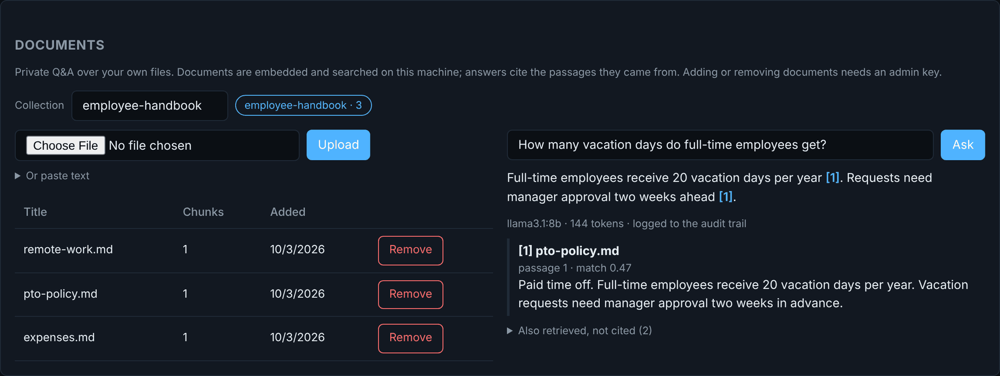

# local-llm-deploy-kit

[](https://github.com/coreymathie/local-llm-deploy-kit/actions/workflows/ci.yml)


Run a **local LLM** on a laptop, desktop, or small on-prem server, behind an **OpenAI-compatible API** with per-app keys, rate limits, a **tamper-evident audit log**, **private document Q&A with citations**, and an admin page.

This is for the most common reason companies want local models: **the data can't leave the building.** Healthcare, legal, and finance teams often can't send prompts to a public API. Ollama makes running a model easy. This kit adds what's needed to let other people and applications use it safely: authentication, limits, audit evidence, and an operator view.

---

## What you get

- **OpenAI-compatible API** at `/v1/chat/completions` (streaming and non-streaming) and `/v1/models`. Point any OpenAI SDK at `http://localhost:8080/v1` and it works.
- **Per-application API keys** with revocation and per-key rate limits, stored in SQLite (no external database).
- **Tamper-evident audit log.** Key creation, key revocation, and model downloads are always recorded. Prompts and completions are recorded when enabled, with optional PII redaction. Each entry is hash-chained to the one before it, and the admin page shows whether the chain is intact.
- **Private document Q&A.** Upload PDFs, Markdown, or text into a collection and ask questions. Answers come only from those documents, cite the passages they used as [1], [2], and every question is recorded in the audit log with the documents it drew on. Embedding, search, and generation all run on the machine.
- **OpenAI-compatible embeddings** at `/v1/embeddings`, using a local embedding model.
- **Admin page** at `/admin`: models, keys, usage per key, documents and a question box, audit chain status, and recent events.
- **Regulated-workload profiles**: `profiles/healthcare.env` and `profiles/finance.env`.
- **Installers** for macOS, Linux, and Windows, plus a Docker Compose option.

---

## Quickstart

**macOS**
```bash
curl -fsSL https://raw.githubusercontent.com/coreymathie/local-llm-deploy-kit/main/scripts/install_macos.sh | bash
```

**Linux**
```bash
curl -fsSL https://raw.githubusercontent.com/coreymathie/local-llm-deploy-kit/main/scripts/install_linux.sh | bash
```

**Windows** (elevated PowerShell)
```powershell
iwr -useb https://raw.githubusercontent.com/coreymathie/local-llm-deploy-kit/main/scripts/install_windows.ps1 | iex
```

Each installer checks prerequisites, installs Ollama if it's missing, pulls `llama3.1:8b`, starts the gateway on `http://127.0.0.1:8080`, prints a one-time admin key, and opens the admin page.

**Manual / development**
```bash
git clone https://github.com/coreymathie/local-llm-deploy-kit.git
cd local-llm-deploy-kit
python -m venv .venv && source .venv/bin/activate
pip install -r requirements.txt
cp .env.example .env                       # or: cp profiles/healthcare.env .env
uvicorn gateway.main:app --host 127.0.0.1 --port 8080
```

**Docker:** `docker compose up -d` (Ollama and the gateway, both bound to localhost).

### Use it

```python
from openai import OpenAI

client = OpenAI(api_key="sk-local-...", base_url="http://localhost:8080/v1")
r = client.chat.completions.create(
    model="llama3.1:8b",
    messages=[{"role": "user", "content": "Summarize this intake note in three bullets: ..."}],
)
print(r.choices[0].message.content)
```

---

## Document Q&A

Load a folder of policies, contracts, or procedures into a collection:

```bash
export GATEWAY_ADMIN_KEY=sk-local-...
python scripts/ingest_folder.py ./employee-handbook --collection handbook   # re-run any time; only new files are added
```

Or upload from the admin page's **Documents** card:



Then ask, with any key:

```bash
curl -s http://localhost:8080/v1/collections/handbook/ask \
  -H "Authorization: Bearer sk-local-..." -H "Content-Type: application/json" \
  -d '{"question": "How much notice do vacation requests need?"}'
```

```json
{
  "answer": "Vacation requests need manager approval two weeks in advance [1].",
  "sources": [
    {"n": 1, "title": "pto-policy.md", "chunk": 0, "score": 0.71, "cited": true, "excerpt": "Paid time off. Full-time..."},
    {"n": 2, "title": "remote-work.md", "chunk": 0, "score": 0.38, "cited": false, "excerpt": "Remote work. Employees..."}
  ],
  "model": "llama3.1:8b",
  "usage": {"total_tokens": 312}
}
```

How it works: documents are split into overlapping, paragraph-aware passages and embedded with a local model (`nomic-embed-text` by default). A question is embedded the same way, the closest passages are retrieved by cosine similarity, and the chat model answers from those passages only. The system prompt tells the model that document text is data, not instructions, so a document saying "ignore previous instructions" is treated as content. Each source is marked `cited` if the answer actually references it, so a reviewer can tell the passages the answer relied on from the ones that were only retrieved.

| Endpoint | Who | Purpose |
|---|---|---|
| `GET /v1/collections` | any key | Collections with document and passage counts |
| `GET /v1/collections/{c}/documents` | any key | Documents in a collection |
| `POST /v1/collections/{c}/documents` | admin | Upload a file (PDF, TXT, MD, CSV, JSON, HTML) |
| `POST /v1/collections/{c}/documents/text` | admin | Add text directly (`{"title", "text"}`) |
| `DELETE /v1/collections/{c}/documents/{id}` | admin | Remove a document and its passages |
| `POST /v1/collections/{c}/ask` | any key | `{"question", "top_k"?, "model"?}` → cited answer |
| `POST /v1/embeddings` | any key | OpenAI-shaped embeddings |

---

## The audit log

`$GATEWAY_LOG_DIR/audit.jsonl` holds one JSON entry per event:

| Event | When |
|---|---|
| `admin_bootstrap` | First admin key created at startup |
| `key_created`, `key_revoked` | Admin key management (keys are stored masked) |
| `model_pull_started`, `model_pull_finished` | Model downloads, with who requested them |
| `completion` | Each prompt and response, if `GATEWAY_LOG_PROMPTS=true` (redacted if `GATEWAY_REDACT_PROMPTS=true`) |
| `document_added`, `document_removed` | Changes to a collection, with who made them |
| `document_question` | Always: which key asked which collection, and which documents and passages the answer used. The question and answer text are included under the same prompt-logging and redaction settings as `completion`. |

Each entry includes the SHA-256 of the previous entry. Editing or deleting a line breaks the chain from that point. `GET /admin/audit/verify` (and the admin page) reports `chain intact` or the first tampered line number. For retention, archive the file to WORM storage; see [`docs/compliance.md`](docs/compliance.md).

---

## Configuration

| Variable | Default | Meaning |
|---|---|---|
| `OLLAMA_HOST` | `http://127.0.0.1:11434` | Where Ollama listens |
| `GATEWAY_HOST` / `GATEWAY_PORT` | `127.0.0.1` / `8080` | Gateway bind address |
| `GATEWAY_DEFAULT_MODEL` | `llama3.1:8b` | Used when a request omits `model` |
| `GATEWAY_RATE_LIMIT_PER_MIN` | `60` | Per key |
| `GATEWAY_LOG_PROMPTS` | `false` | Record prompts/completions in the audit log |
| `GATEWAY_REDACT_PROMPTS` | `false` | Redact SSNs, card numbers, DOBs, emails, phones in those entries |
| `GATEWAY_LOG_DIR` | `./logs` | Audit log location |
| `GATEWAY_DB_PATH` | `./gateway.db` | SQLite for keys and usage |
| `GATEWAY_ADMIN_BOOTSTRAP_KEY` | auto | Leave blank to generate one on first run |
| `GATEWAY_EMBED_MODEL` | `nomic-embed-text` | Local embedding model for documents and `/v1/embeddings` |
| `GATEWAY_MAX_UPLOAD_MB` | `20` | Largest document upload |

---

## Why not just use Ollama directly?

Ollama's port (`11434`) has no authentication, no per-app keys, no rate limits, no audit trail, and no admin view. On a shared machine, a VPN, or a small on-prem server, those are the first things an operations or compliance team asks for. The second request is usually "let it answer questions about our own documents", without sending them to a hosted service.

## Tests

```bash
pip install ruff && ruff check gateway tests scripts && pytest -q
```

Tests run against a mocked Ollama (including a bag-of-words embedding model, so retrieval behaves realistically) and cover authentication, admin-only routes, OpenAI-compatible responses, usage accounting, rate limiting, key revocation, background model pulls, PII redaction, tamper detection, document upload (including PDFs), retrieval and citations, the prompt-injection guard, audit entries for questions, upload limits, and the folder ingest script.

## Layout

```
gateway/     main.py (routes), rag.py (documents, embeddings, retrieval), auth.py, store.py (SQLite),
             audit.py (hash chain), redact.py, config.py
admin-ui/    index.html (single-file admin page)
scripts/     install_macos.sh, install_linux.sh, install_windows.ps1, ingest_folder.py
profiles/    healthcare.env, finance.env
docs/        quickstart, compliance, enterprise (service install, TLS, air-gap), Windows notes
```

## Limitations

- Rate limits are in memory, per process. Multiple gateway processes need a shared store such as Redis.
- SQLite handles small teams well; heavy concurrent write loads should move to Postgres.
- PII redaction is pattern-based, not a full DLP.
- Document search is exact (every passage is scored), which is fast for a few thousand documents. Larger libraries should move the vectors to an index such as sqlite-vec or pgvector.
- Scanned PDFs without a text layer need OCR first; the gateway reads the PDF's text, not its images.
- Collection access is all-or-nothing per key: any key can ask any collection. Per-collection permissions are on the roadmap.
- The admin page has no login of its own; it uses an admin API key held in the browser tab's session storage. Keep the gateway on localhost or a VPN interface.

## License

MIT.
