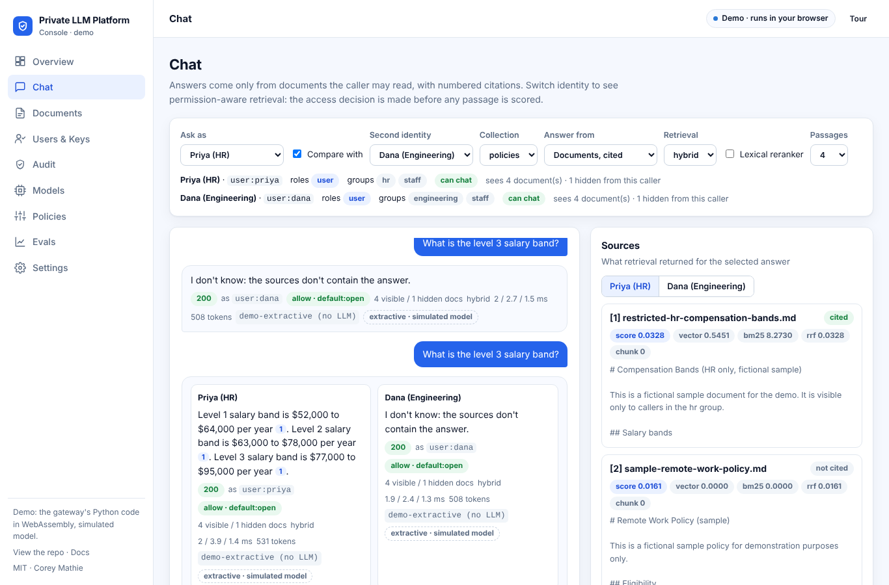
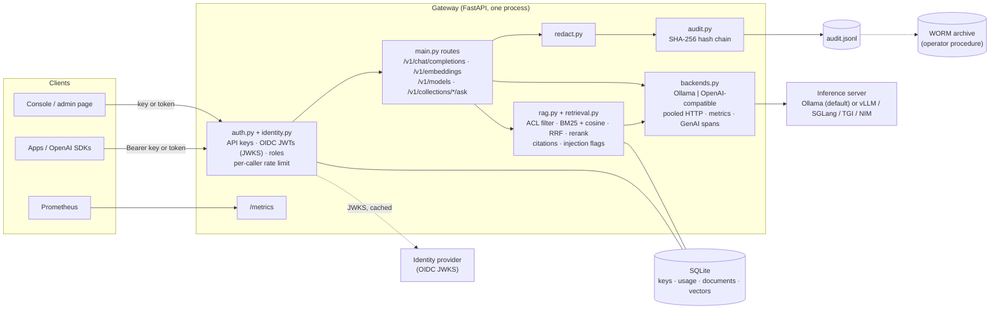

# Private LLM Platform

[](https://github.com/coreymathie/private-llm-platform/actions/workflows/ci.yml)


**A private ChatGPT for your documents, with the access control, audit trail and model governance a
compliance team asks for.** An OpenAI-compatible gateway in front of a local model server (**Ollama** on a
laptop or small server, or **vLLM / SGLang / TGI / NVIDIA NIM** on a GPU host), cited answers over
permission-aware hybrid retrieval, per-application API keys and **OIDC single sign-on with group-based
roles**, rate limits, PII redaction, a **tamper-evident audit log**, model pinning with a CycloneDX ML-BOM,
Prometheus metrics, OpenTelemetry GenAI spans, and a product console.

**▶ [Open the live console](https://coreymathie.github.io/private-llm-platform/demo/)**: the gateway's real
Python modules (keys and rate limiting, roles and permission-aware retrieval, citations, the audit hash
chain, policy validation, model pinning, the RAG eval) run in your browser through Pyodide. Nothing leaves
the page. There is no LLM in the browser; answers are extractive and labelled as simulated.



---

## Contents

[Console](#console) · [Problem](#the-problem) · [Architecture](#architecture) · [Key decisions](#key-decisions) ·
[Security and governance](#security-and-governance) · [Identity and roles](#identity-and-roles) · [Quality](#quality) ·
[Observability](#observability) · [Benchmarks](#benchmarks) · [Failure modes](#failure-modes) ·
[Quickstart](#quickstart) · [Document Q&A](#document-qa) · [Audit log](#the-audit-log) ·
[Configuration](#configuration) · [Roadmap](#roadmap)

## Console

One set of static files in [`demo/`](demo/) (`index.html`, `app.js`, `screens.js`, `adapters.js`, `ui.js`,
`styles.css`) runs in two modes:

- **Demo** (GitHub Pages): `DemoAdapter` loads Pyodide 0.26.4 and runs the gateway's own modules through
  `demo/engine.py`, with a simulated backend (hashed bag-of-words embeddings, extractive answers, a stand-in
  Ollama model inventory). The header says *Demo · runs in your browser*.
- **Live**: the gateway serves the same files at `/console/` and `LiveAdapter` calls its HTTP API with the
  admin key or token you enter on Settings (kept in memory, or in `sessionStorage` if you ask). The header
  says *Live · connected to &lt;host&gt;*. Mode comes from `GET ./api-mode` (a static file says `demo`; the
  gateway answers `live`) or `?mode=demo|live`.

| Screen | What it does |
|---|---|
| Overview | Requests, identities, collections and documents, retrieval quality (from the eval), audit chain status, access decisions; activity and audit-event charts; guided "what to try" cards |
| Chat | ChatGPT-style chat with numbered citations and a source panel (score components, access rule, cited or not, injection flags); ask as any persona or API key, compare two identities side by side, switch retrieval mode, lexical reranker and passage count per request, or use model-only chat (readers get 403) |
| Documents | Collections and the document library: paste or upload, per-collection and per-document access-list editor, and an access matrix of which caller can read which document and the rule that decided it |
| Users & Keys | API keys with groups, per-minute usage against the rate limit, burst test, revoke; SSO group-to-role mapping and token users |
| Audit | The hash-chained log with filters and search; each row opens a decision timeline (authenticate, access decision, retrieval, sources, generation, answer, hashes). Demo mode adds tamper/restore |
| Models | Backend health, served models, verification against the lock file, off/warn/enforce policy, lock-file validation, ML-BOM model components. Demo mode adds pin, simulated re-pull and a policy check |
| Policies | The runtime policy (group roles, default collection access, retrieval, rate limit, model policy) as JSON, validated with the gateway's own types and `identity.check_role`, applied and audited, with a scenario re-run before and after |
| Evals | The `scripts/rag_eval.py` scorecard per configuration against `evals/thresholds.json`, misses per question; demo mode re-runs the eval in the browser and compares |
| Settings | Mode, credential (live), modules running in the tab (demo), and what is simulated |

A five-step guided tour runs on the first visit. **Run it live:**

```bash
docker compose up        # then open http://localhost:8080/console/
docker compose logs gateway | grep "Bootstrap admin"     # the admin key to paste on Settings
```

That stack needs no model or GPU: the gateway talks to `mock-llm`, which is
[`scripts/mock_openai_server.py`](scripts/mock_openai_server.py) in **simulated** mode (extractive answers,
hashed embeddings; not a language model). Overview's *Load sample data* adds the sample policies and three
keys through the API. For real answers, Ollama stays the default backend:
`docker compose --env-file profiles/compose-ollama.env --profile ollama up -d`, then pull `llama3.1:8b` and
`nomic-embed-text` (see the top of `docker-compose.yml`). The older single-file admin page is still served
at `/admin`.

New endpoints for the console (all admin-only): `GET /admin/overview`, `GET /admin/audit/entries`,
`GET /admin/access-matrix?collection=`, `GET /admin/policy`, `POST /admin/policy/validate`,
`PUT /admin/policy` (in memory, audited as `policy_changed`; a restart reads the environment again),
`GET /admin/rate-limits`, `POST /admin/models/lock/validate`, `GET /admin/models/mlbom`; plus
`GET /console/api-mode` and per-request `retrieval_mode` / `reranker` on `/ask`.

## The problem

Healthcare, legal and finance teams often can't send prompts or documents to a public API. Running a
model locally is easy now; letting *other people and applications* use it safely is not. A bare model
server port has no authentication, no per-application identity, no limits, no record of who asked what,
and no way to show an auditor that the record wasn't edited. When document Q&A is added, two more
questions follow: *which documents did this answer rely on*, and *what happens when a document contains
instructions*?

This kit answers those with a small, readable codebase (one FastAPI process, SQLite, a JSONL log) that
installs on a laptop and also fronts a GPU inference server.

## Architecture



A chat request: the key is checked against SQLite and the per-key sliding-window limiter; the request
is mapped to the configured backend; the response (or SSE stream) is mapped back to the OpenAI format;
usage is counted per key; and, if enabled, the prompt and answer are redacted and appended to the hash
chain. A document question adds retrieval (cosine similarity over vectors in SQLite), a prompt that
treats passages as data, citation tracking, injection flags, and an always-on audit entry listing the
passages used.

## Key decisions

| ADR | Decision |
|---|---|
| [0001](docs/adr/0001-inference-backend.md) | Ollama by default; any OpenAI-compatible server (vLLM, SGLang, TGI, NIM) as a pluggable, instrumented backend with an unchanged gateway API |
| [0002](docs/adr/0002-local-embeddings-on-host-vector-store.md) | Local embeddings, vectors in the gateway's SQLite file, exact cosine search; ANN index and hybrid search when scale demands |
| [0003](docs/adr/0003-audit-log-hash-chain-vs-worm.md) | Hash-chained JSONL log on the host for tamper evidence, WORM storage for retention (and for the chain's unprotected tail) |
| [0004](docs/adr/0004-prompt-injection-defense-in-depth.md) | Prompt-injection guard as defense in depth (prompt separation, heuristic flags, no tools or secrets in context, curated sources), not a fix |
| [0005](docs/adr/0005-oidc-identity-and-roles.md) | OIDC access tokens verified locally against the IdP's JWKS, alongside API keys; roles (admin, user, reader:&lt;collection&gt;) from IdP groups |
| [0006](docs/adr/0006-hybrid-retrieval-and-rag-evals.md) | Hybrid BM25 + vector retrieval fused with Reciprocal Rank Fusion, pluggable reranker, RAG eval gate in CI |
| [0007](docs/adr/0007-envelope-encryption-at-rest.md) | Envelope encryption for passages, vectors and audit text with a pluggable key provider; keys never in backups |
| [0008](docs/adr/0008-model-pinning-and-ml-bom.md) | Pinned model digests verified against what is served, off/warn/enforce policy, CycloneDX ML-BOM |

## Security and governance

| Concern | Control | Where |
|---|---|---|
| Who is calling | One API key per application, or an OIDC access token per person (RS256/ES256 allow-list, JWKS with rotation, `iss`/`aud`/`exp` checks) | `gateway/identity.py`, `gateway/auth.py` |
| What they may do | Roles `admin`, `user`, `reader:<collection>` from IdP groups; admin-only key, document and model routes; last-admin guard | `gateway/identity.py`, `gateway/main.py` |
| Which documents they may see (OWASP LLM08) | Collection and document access lists (`group:`, `key:`, `user:`) applied in SQL **before** passages are scored; hidden documents never reach the prompt, sources, citations, injection flags or counts; decisions and denials audited | `gateway/rag.py`, `gateway/identity.py` |
| Abuse and noisy neighbours | Per-key sliding-window rate limit (429); upload size limit; `top_k` and batch caps | `gateway/auth.py`, `gateway/main.py` |
| Evidence | Admin actions, document changes and every document question in a SHA-256 hash-chained log; `verify()` reports the first tampered line | `gateway/audit.py` |
| PII in logs | Prompt logging off by default; pattern-based redaction of SSNs, Luhn-valid cards, DOBs, emails, US phones; optional AES-256-GCM sealing of prompt/answer text in audit entries | `gateway/redact.py`, `gateway/crypto.py` |
| Data at rest | Envelope encryption (AES-256-GCM, a data key per document, wrapped by a rotatable key-encryption key) for passages and vectors; keys never in backups | `gateway/crypto.py`, `scripts/keys.py` |
| Recovery | Online SQLite backup + audit log with checksummed manifest; restore verifies checksums, integrity, the audit chain and key availability before touching anything | `scripts/backup.py`, `scripts/restore.py` |
| Prompt injection | Passages as numbered data; system prompt says to ignore instructions in them; suspicious passages flagged in response and audit | `gateway/rag.py` |
| Model supply chain (OWASP LLM03) | Lock file of pinned model digests (Ollama manifests or weight-file SHA-256); verified at startup, after pulls, on demand and on an interval; `warn` or `enforce` policy (403); CycloneDX 1.6 ML-BOM | `gateway/supply_chain.py`, `scripts/mlbom.py` |
| Data residency | No outbound calls except the configured inference server; caller keys never forwarded upstream; no prompt text in metrics or traces | `gateway/backends.py`, `gateway/telemetry.py` |

- [Threat model](docs/threat-model.md): STRIDE and the OWASP Top 10 for LLM Applications (2025), each
  mapped to a control, a test, and the residual risk.
- [Controls mapping](docs/controls.md): HIPAA 45 CFR 164.312(a)–(e), SOC 2 CC6/CC7, NIST AI RMF and
  NIST AI 600-1, ISO/IEC 42001 Annex A, with code and test per row and the gaps marked as roadmap.
- [Compliance notes](docs/compliance.md): profiles, WORM retention, air-gap install, monthly review.
- [Operations](docs/operations.md): encryption at rest, key rotation, backup and restore, RTO/RPO guidance.
- [Kubernetes](docs/kubernetes.md): Helm chart, NetworkPolicy, GPU values, air-gapped bundle.

Not implemented yet, and stated as such everywhere: SCIM provisioning and a login flow in the admin page
(it accepts a pasted token), ACL sync from source systems, a KMS key provider (only a local keyring ships;
API keys are stored unhashed in SQLite), model *signature* verification (digests are pinned and checked,
provenance is not). See [Roadmap](#roadmap).

## Identity and roles

API keys work as before. With `GATEWAY_OIDC_ENABLED=true` the gateway also accepts access tokens (JWTs)
from your identity provider on the same `Authorization: Bearer` header, verifies them locally against the
issuer's JWKS, and maps the token's groups to roles ([ADR 0005](docs/adr/0005-oidc-identity-and-roles.md)).

| Role | Granted to | Allows |
|---|---|---|
| `admin` | admin API keys; IdP groups mapped to `admin` | Everything: keys, documents, audit, model pulls, all collections |
| `user` | other API keys; groups mapped to `user` | Chat, embeddings, model list; collections their access allows |
| `reader:<collection>` / `reader:*` | groups mapped to it | List and ask that collection only (no raw chat) |

```bash
GATEWAY_OIDC_ENABLED=true
GATEWAY_OIDC_ISSUER=https://idp.example.com/realms/corp
GATEWAY_OIDC_AUDIENCE=llm-gateway
GATEWAY_OIDC_GROUP_ROLES='{"llm-admins": ["admin"], "staff": ["user"], "hr-team": ["reader:hr-policies"]}'
```

`GET /v1/me` shows how the gateway sees the caller (kind, label, roles, groups, readable collections);
`GET /admin/users` lists token users with their usage. The admin page accepts an API key or a pasted
access token and shows only the cards the role allows. A valid token whose groups map to no role gets
`403`; if the IdP can't be reached before its keys were ever fetched, token requests get `503`.

## Quality

- **218 automated tests** (186 through v0.6 plus 32 added in v0.7; parametrized cases counted individually),
  all passing, run in CI with `ruff check`, `ruff format --check`, `shellcheck` and (CI only) `helm lint`.
- Upstream HTTP is mocked for both backends: Ollama's native API and the OpenAI wire format (chat,
  SSE streaming with usage, embeddings, models, errors before the first token).
- **RAG evals gate CI**: `scripts/rag_eval.py --check` runs the real ingestion, access-control and
  retrieval code over a bundled golden set (12 fictional documents, 2 of them restricted, 43 questions)
  and fails on a drop below `evals/thresholds.json` or any ACL leak. Measured at k=4 with the demo's
  hashed bag-of-words embedder (not a neural model) and extractive answerer (no LLM), so a regression
  baseline rather than a quality claim ([ADR 0006](docs/adr/0006-hybrid-retrieval-and-rag-evals.md)):

| Configuration | recall@1 | recall@4 | MRR | citation accuracy | answer contains | ACL leaks |
|---|---:|---:|---:|---:|---:|---:|
| `vector+none` | 0.907 | 0.977 | 0.942 | 0.884 | 0.954 | 0 |
| `bm25+none` | 1.000 | 1.000 | 1.000 | 0.837 | 0.977 | 0 |
| `hybrid+none` | 0.954 | 1.000 | 0.977 | 0.837 | 0.977 | 0 |
| `hybrid+lexical` | 1.000 | 1.000 | 1.000 | 0.837 | 0.954 | 0 |

- Docs are tested too: every `tests/…::test_name` and `gateway/…::symbol` referenced in `docs/` and this
  README must exist (`tests/test_docs.py`), and every metric the Grafana dashboard queries must be
  exported (`tests/test_metrics.py`).
- The console's browser engine runs under CPython in the suite (`tests/test_demo_engine.py`,
  `tests/test_console_engine.py`), and `scripts/demo_smoke.py` drives the real console headlessly with
  Playwright in both modes: every screen and its key interaction in demo mode, then the gateway and the
  simulated backend under uvicorn in live mode (35 checks, no console errors, no horizontal scroll at 390 px).

| Test file | Covers |
|---|---|
| `test_helm_chart.py`, `test_airgap_bundle.py` | Values validated against `values.schema.json` (unsafe values rejected); templates rendered by a Go `text/template` harness (not helm) and checked (hardening, probes, GPU, NetworkPolicy, offline vLLM, keyring, OIDC read back through `Settings`, failing renders); air-gap dry run, real bundle, checksum verify and tamper detection, shellcheck |
| `test_supply_chain.py` | Lock-file validation; enforce/warn across chat, embeddings, ingestion and questions; digest swap caught by admin re-verify, by the interval, and re-checked after pulls; startup verification audited and bounded; weight-file hashing for OpenAI-compatible servers; ML-BOM validated against the CycloneDX 1.6 schema; trust-on-first-use pinning |
| `test_encryption.py`, `test_backup_restore.py` | Sealed passages and vectors on disk, row binding, wrong key, hidden documents' keys never unwrapped, encrypting existing data, rotation and retirement, sealed audit fields with key-free verification, startup validation; full backup/restore drill and refusal cases |
| `test_retrieval.py` | BM25, RRF, rank modes, lexical and cross-encoder rerankers, per-mode `/ask` (BM25 doesn't embed the question), the eval gate meets thresholds with no ACL leaks, and published eval numbers match a fresh run |
| `test_acl.py` | Permission-aware retrieval: no cross-group leakage in answers, citations, injection flags, counts, listings or prompts; SQL filtering before scoring; collection ACLs, restricted default, OIDC groups, per-user grants; audited ACL changes; v0.5 database upgrade |
| `test_identity.py` | OIDC: RS256/ES256, JWKS discovery, caching, rotation and outage; `alg` allow-list (none, HMAC confusion); `iss`/`aud`/`exp`/`nbf`/skew; groups → roles on admin routes and collections; metrics privacy; real HTTP JWKS |
| `test_gateway.py` | Auth, admin-only routes, OpenAI-shaped responses, usage accounting, rate limit, revocation, last-admin guard, background pulls, redacted audit entries, tamper detection |
| `test_documents.py` | Ingestion, retrieval picks the right document, citations, injection guard prompt, audited questions with redaction, PDFs, upload limits |
| `test_backends.py` | Both backends: chat, streaming + `include_usage`, embeddings order, models, upstream auth, 501 pull, error mapping, pooled HTTP client |
| `test_metrics.py`, `test_telemetry.py` | `/metrics` labels (route templates, key labels, never key values), tokens, TTFT, 401/429, token protection; GenAI span attributes, no prompt text, no-op without OTel |
| `test_injection_flags.py`, `test_redact.py` | Injection heuristics (payloads flagged, ordinary text not); redaction patterns |
| `test_console.py`, `test_console_engine.py` | Console endpoints (overview, audit entries, access matrix, runtime policy with validation, effect and audit, rate-limit window, lock validation, ML-BOM), admin-only access, per-request retrieval switches, the simulated mock backend and the compose stack end to end, eval data drift, page assets; the browser engine's console calls (pin, re-pull, enforce, policy, in-browser eval) |
| `test_loadtest.py`, `test_demo_engine.py`, `test_deploy_config.py`, `test_docs.py`, `test_ingest_folder.py` | Load-test math and an in-process run; demo engine; compose/profile sanity; doc references; folder ingest |

## Observability

- **`GET /metrics`** (Prometheus): `gateway_http_requests_total{method,route,status,key}`,
  `gateway_http_request_duration_seconds`, `gateway_llm_tokens_total{key,model,type}`,
  `gateway_llm_request_duration_seconds{operation,backend,model}`,
  `gateway_llm_time_to_first_token_seconds`, `gateway_backend_errors_total{operation,backend,reason}`,
  `gateway_info`. The `key` label is the key's **label** (e.g. `hr-bot`), never the secret; unknown
  paths collapse to `route="unmatched"`. Set `GATEWAY_METRICS_TOKEN` to require a bearer token.
- **Grafana**: import [`deploy/grafana-dashboard.json`](deploy/grafana-dashboard.json) (requests by
  route, 5xx ratio, latency and TTFT percentiles, tokens/s per key, backend latency and errors,
  rejected requests by status). Scrape config: [`deploy/prometheus.yml`](deploy/prometheus.yml).
- **OpenTelemetry**: each backend call opens a client span named `chat <model>` / `embeddings <model>`
  with `gen_ai.operation.name`, `gen_ai.provider.name`, `gen_ai.request.model`,
  `gen_ai.request.temperature`, `gen_ai.request.max_tokens`, `gen_ai.usage.input_tokens`,
  `gen_ai.usage.output_tokens` and `error.type`. No-op unless `opentelemetry` is installed; export with
  the standard SDK setup (`pip install opentelemetry-distro opentelemetry-exporter-otlp`, then `opentelemetry-instrument uvicorn gateway.main:app`).
  Span content is tested with the SDK's in-memory exporter; export to a live collector has not been tested here.

## Benchmarks

**No model-serving numbers are published yet.** The build environment couldn't download model weights,
so instead of estimates there is a method and a template: [docs/benchmarks.md](docs/benchmarks.md) and
`scripts/loadtest.py` (TTFT, tokens/s, p50/p95/p99 latency and error rate at configurable concurrency).

What *was* measured is the gateway's own overhead, against a stub upstream that streams 64 tokens
instantly (2 vCPUs shared by client, gateway and stub; one uvicorn worker):

| Concurrency | Direct to stub, p50 | Through gateway, p50 | Gateway throughput |
|---:|---:|---:|---:|
| 1 | 3.5 ms | 9.2 ms | 102 req/s |
| 8 | 25.5 ms | 68.2 ms | 112 req/s |
| 32 | 86.5 ms | 292.6 ms | 106 req/s |

Also measured here, each labeled with its setup: retrieval quality on the bundled golden set (above, under
[Quality](#quality)) and the cost of encryption at rest plus backup/restore time on a synthetic
3,883-passage collection ([docs/operations.md](docs/operations.md), `scripts/bench_storage.py`).

That measurement found a real bottleneck: building an HTTP client per upstream call cost about 48 ms of
blocking CPU and capped the gateway at about 17 req/s. v0.5 pools one client per event loop (about 6x
throughput on the same host). Details, hardware and reproduction steps are in the benchmarks doc.

## Failure modes

| Situation | Behavior | Notes |
|---|---|---|
| Inference server down or unreachable | `502 model runtime unavailable: <error>`; `/health` reports `backend_ok: false`; `gateway_backend_errors_total` increments | For streaming too: the first event is read before the response starts, so clients get a 502, not a broken 200 stream |
| Inference server returns an error | Status and body passed through (e.g. 404 unknown model) | Same contract as v0.4 |
| Stream fails after the first token | The stream ends early; usage, token metrics and the `completion` audit entry for that request are not recorded | Not retried; the backend error is counted in `gateway_backend_errors_total` |
| Key over its limit | `429 rate limit exceeded (N/min)`, counted per key label in metrics | Limiter is in memory, per process |
| More than one gateway process | Each process enforces its own limit (effective limit × N); audit appends are serialized per process only | Run one process per host, or add a shared store (roadmap). The Helm schema caps `replicaCount` at 1 |
| Revoked or unknown key | `401` | |
| Expired, forged or wrong-audience token | `401` with `WWW-Authenticate: Bearer error="invalid_token"` | Detail says which check failed |
| Identity provider unreachable | Cached signing keys keep working for one more cache period (`GATEWAY_OIDC_JWKS_CACHE_SECONDS`), then token requests get `503`; API keys are unaffected | No keys fetched yet: `503` immediately |
| IdP rotates its signing key | Unknown `kid` triggers one JWKS refetch (at most every 30 s); retired keys stop working after the next refetch | |
| `/v1/pull` with a non-Ollama backend | `501` | The inference server owns its models |
| Model not pinned, or its digest changed (`GATEWAY_MODEL_POLICY=enforce`) | `403 model 'x' is not allowed by the model policy (unpinned \| mismatch \| missing \| error)`; audited `model_verification` | `warn` serves it, logs once per verification and counts `gateway_model_policy_decisions_total` |
| Backend unreachable during model verification | Startup continues after at most 10 s; under `enforce` requests get `403 (error)` until verification succeeds | Fails closed |
| Audit file edited | `GET /admin/audit/verify` returns the first bad line | Rewriting the newest entries isn't detectable without the WORM copy (ADR 0003) |
| Caller lacks access to a collection or document | Same `404`/empty list as a missing collection; denial audited | No existence oracle through the API |
| Poisoned document | Passage flagged (`injection_flags`); its instructions are not supposed to be followed, but its claims can be cited | ADR 0004; only admins can add documents |
| Large collections | Exact search scores every readable passage on each question, and BM25 tokenizes them per question | Measured 182–248 ms per hybrid retrieval over 3,883 passages on a 2-vCPU host (`scripts/bench_storage.py`); ANN and full-text indexes are roadmap |
| Encryption key missing, wrong, or data altered | Startup refused if the key can't load; `/ask` returns `500 stored documents could not be decrypted` | Fails closed; see [operations](docs/operations.md) |
| Cross-encoder reranker without `sentence-transformers` or a local model | Fails on the first question with a clear error | Interface only in this repo; not tested here |
| Concurrent writes | SQLite serializes writers | Postgres for heavy multi-writer loads (roadmap) |

## Quickstart

**macOS**
```bash
curl -fsSL https://raw.githubusercontent.com/coreymathie/private-llm-platform/main/scripts/install_macos.sh | bash
```

**Linux**
```bash
curl -fsSL https://raw.githubusercontent.com/coreymathie/private-llm-platform/main/scripts/install_linux.sh | bash
```

**Windows** (elevated PowerShell)
```powershell
iwr -useb https://raw.githubusercontent.com/coreymathie/private-llm-platform/main/scripts/install_windows.ps1 | iex
```

Each installer checks prerequisites, installs Ollama if it's missing, pulls `llama3.1:8b` and
`nomic-embed-text`, starts the gateway on `http://127.0.0.1:8080`, prints a one-time admin key, and
opens the admin page.

**Manual / development**
```bash
git clone https://github.com/coreymathie/private-llm-platform.git
cd private-llm-platform
python -m venv .venv && source .venv/bin/activate
pip install -r requirements.txt
cp .env.example .env                       # or: cp profiles/healthcare.env .env
uvicorn gateway.main:app --host 127.0.0.1 --port 8080
```

**Docker:** `docker compose up -d` starts the gateway and console on `http://localhost:8080/console/`
with a simulated backend (no model; see [Console](#console)). For real answers from Ollama:
`docker compose --env-file profiles/compose-ollama.env --profile ollama up -d`. Ports bind to localhost.

**Kubernetes:** Helm chart in [`deploy/helm/local-llm-gateway`](deploy/helm/local-llm-gateway) (gateway,
optional vLLM on NVIDIA GPUs, PVC, Secrets, probes, NetworkPolicy, ServiceMonitor), and
`scripts/airgap_bundle.sh` for offline installs. See [docs/kubernetes.md](docs/kubernetes.md), including
what was and wasn't validated (`helm lint` could not be run in the build environment; CI runs it).

**vLLM on an NVIDIA GPU** (opt-in compose profile):
```bash
OPENAI_COMPAT_BASE_URL=http://vllm:8000/v1 VLLM_MODEL=Qwen/Qwen2.5-7B-Instruct \
  GATEWAY_DEFAULT_MODEL=Qwen/Qwen2.5-7B-Instruct docker compose --profile vllm up -d
```
Or point the gateway at any OpenAI-compatible server you already run:
`BACKEND=openai_compatible OPENAI_COMPAT_BASE_URL=http://gpu-host:8000/v1 OPENAI_COMPAT_API_KEY=...`.
Document Q&A also needs an embedding model at that URL; see [ADR 0001](docs/adr/0001-inference-backend.md).

### Use it

```python
from openai import OpenAI

client = OpenAI(api_key="sk-local-...", base_url="http://localhost:8080/v1")
r = client.chat.completions.create(
    model="llama3.1:8b",
    messages=[{"role": "user", "content": "Summarize this intake note in three bullets: ..."}],
)
print(r.choices[0].message.content)
```

Streaming works the same way; pass `stream_options={"include_usage": True}` to get a final usage chunk.

## Document Q&A

Load a folder of policies, contracts, or procedures into a collection:

```bash
export GATEWAY_ADMIN_KEY=sk-local-...
python scripts/ingest_folder.py ./employee-handbook --collection handbook   # re-run any time; only new files are added
```

Or upload from the admin page's **Documents** card:


Then ask, with any key:

```bash
curl -s http://localhost:8080/v1/collections/handbook/ask \
  -H "Authorization: Bearer sk-local-..." -H "Content-Type: application/json" \
  -d '{"question": "How much notice do vacation requests need?"}'
```

```json
{
  "answer": "Vacation requests need manager approval two weeks in advance [1].",
  "sources": [
    {"n": 1, "title": "pto-policy.md", "chunk": 0, "score": 0.71, "cited": true, "injection_flags": [], "excerpt": "Paid time off. Full-time..."},
    {"n": 2, "title": "remote-work.md", "chunk": 0, "score": 0.38, "cited": false, "injection_flags": [], "excerpt": "Remote work. Employees..."}
  ],
  "model": "llama3.1:8b",
  "usage": {"total_tokens": 312}
}
```

(Illustrative response shape; scores depend on the embedding model.)

Documents are split into overlapping, paragraph-aware passages and embedded with a local model
(`nomic-embed-text` by default). Among the passages the caller may read, retrieval ranks by BM25 and by
cosine similarity of embeddings and fuses the two rankings with Reciprocal Rank Fusion
(`GATEWAY_RETRIEVAL_MODE=hybrid`, the default; `vector` is the v0.5 behavior, `bm25` skips embedding the
question); an optional reranker (`GATEWAY_RERANKER=lexical`, or `cross_encoder` with a local
sentence-transformers model, untested here) reorders the top candidates. The chat model answers from
the top passages only. Each source's `score` is the final ranking score, with `scores` holding the
components (`vector`, `bm25`, `rrf`, `rerank`). Each source is
marked `cited` if the answer references it, and `injection_flags` lists any injection heuristics the
passage matched.

### Who can read what

Access is decided per caller **before** any passage is loaded (`gateway/rag.py::access_for`):

1. **Collection:** the `admin` role reads everything; `reader:<c>` / `reader:*` roles open a collection;
   otherwise, if the collection has an access list, the caller must match an entry; if it has none,
   `GATEWAY_COLLECTION_DEFAULT_ACCESS` decides (`open`: any `user`-role caller, the v0.5 behavior;
   `restricted`: nobody else, the default in the healthcare and finance profiles).
2. **Document:** a document with its own access list is visible only to callers matching an entry (a
   reader role doesn't override it); a document without one inherits the collection decision.

Entries are `group:<name>` (IdP groups, or groups given to an API key at creation), `key:<label>` and
`user:<username>`. Hidden documents are filtered in SQL, so they are never scored, sent to the model,
cited, flagged or counted, and a collection the caller can't read answers exactly like one that doesn't
exist. Every `document_question` audit entry records the decision (`access.basis`, documents visible and
hidden) and the rule that admitted each source; refusals are logged as `document_question_denied`.

```bash
curl -X POST localhost:8080/admin/keys -H "Authorization: Bearer $ADMIN" -H "Content-Type: application/json" \
  -d '{"label": "hr-bot", "groups": ["hr"]}'
curl -X PUT localhost:8080/admin/collections/handbook/acl -H "Authorization: Bearer $ADMIN" \
  -H "Content-Type: application/json" -d '{"principals": ["group:hr", "group:staff"]}'
```

| Endpoint | Who | Purpose |
|---|---|---|
| `GET /v1/collections` | any caller | Collections the caller may read, with counts of only the documents it may read |
| `GET /v1/collections/{c}/documents` | any caller | Documents in a collection the caller may read (access lists shown to admins only) |
| `POST /v1/collections/{c}/documents` | admin | Upload a file (PDF, TXT, MD, CSV, JSON, HTML); optional form field `acl` |
| `POST /v1/collections/{c}/documents/text` | admin | Add text directly (`{"title", "text", "acl"?}`) |
| `DELETE /v1/collections/{c}/documents/{id}` | admin | Remove a document and its passages |
| `PUT /v1/collections/{c}/documents/{id}/acl` | admin | Replace a document's access list (`{"principals": [...]}`; `[]` inherits the collection's) |
| `GET`/`PUT /admin/collections/{c}/acl` | admin | Read or replace a collection's access list |
| `POST /v1/collections/{c}/ask` | any caller with read access | `{"question", "top_k"?, "model"?, "retrieval_mode"?, "reranker"?}` → cited answer from the documents the caller may read, with `timings_ms` |
| `POST /v1/embeddings` | any key | OpenAI-shaped embeddings |

## Model supply chain

```bash
python scripts/pin_models.py --out models.lock.json        # pins what is served now (trust on first use)
GATEWAY_MODEL_LOCK_FILE=./models.lock.json GATEWAY_MODEL_POLICY=enforce uvicorn gateway.main:app
python scripts/mlbom.py --lock models.lock.json --verify --out mlbom.cdx.json   # CycloneDX 1.6 ML-BOM
```

`GET /admin/models/verification` shows each model's status (`verified`, `mismatch`, `missing`,
`unpinned`, `unverifiable`, `error`); `POST /admin/models/verify` re-checks now. Pinning records what is
served at that moment: compare digests with the publisher's before relying on them
([ADR 0008](docs/adr/0008-model-pinning-and-ml-bom.md)).

## The audit log

`$GATEWAY_LOG_DIR/audit.jsonl` holds one JSON entry per event:

| Event | When |
|---|---|
| `admin_bootstrap` | First admin key created at startup |
| `key_created`, `key_revoked` | Admin key management (keys are stored masked) |
| `model_pull_started`, `model_pull_finished` | Model downloads, with who requested them |
| `model_verification` | Served models checked against the lock file (startup, after pulls, admin), with counts and problems |
| `completion` | Each prompt and response, if `GATEWAY_LOG_PROMPTS=true` (redacted if `GATEWAY_REDACT_PROMPTS=true`) |
| `document_added`, `document_removed` | Changes to a collection, with who made them |
| `document_question` | Always: which caller asked which collection, the access decision, and which passages were retrieved, cited and flagged (with the rule that admitted each). Question and answer text follow the prompt-logging and redaction settings. |
| `document_question_denied` | A caller asked a collection whose documents it may not read |
| `collection_acl_changed`, `document_acl_changed` | Access-list changes, before and after, with who made them |
| `policy_changed` | Runtime policy applied from the console (`PUT /admin/policy`), before and after, with who applied it |

Each entry includes the SHA-256 of the previous entry. Editing or deleting a line breaks the chain from
that point. `GET /admin/audit/verify` (and the admin page) reports `chain intact` or the first tampered
line number; the console's Audit screen shows each entry as a decision timeline. Archive the file to WORM storage; see [`docs/compliance.md`](docs/compliance.md).

## Configuration

| Variable | Default | Meaning |
|---|---|---|
| `BACKEND` | `ollama` | `ollama` or `openai_compatible` (vLLM, SGLang, TGI, NIM, ...) |
| `OLLAMA_HOST` | `http://127.0.0.1:11434` | Where Ollama listens |
| `OPENAI_COMPAT_BASE_URL` | `http://127.0.0.1:8000/v1` | OpenAI-compatible server, including `/v1` |
| `OPENAI_COMPAT_API_KEY` | empty | Sent upstream as a bearer token if set |
| `GATEWAY_HOST` / `GATEWAY_PORT` | `127.0.0.1` / `8080` | Gateway bind address |
| `GATEWAY_DEFAULT_MODEL` | `llama3.1:8b` | Used when a request omits `model` |
| `GATEWAY_RATE_LIMIT_PER_MIN` | `60` | Requests per minute, applied to each key (same limit for every key) |
| `GATEWAY_LOG_PROMPTS` | `false` | Record prompts/completions in the audit log |
| `GATEWAY_REDACT_PROMPTS` | `false` | Redact SSNs, card numbers, DOBs, emails, phones in those entries |
| `GATEWAY_LOG_DIR` | `./logs` | Audit log location |
| `GATEWAY_DB_PATH` | `./gateway.db` | SQLite for keys, usage, documents and vectors |
| `GATEWAY_ADMIN_BOOTSTRAP_KEY` | auto | Leave blank to generate one on first run |
| `GATEWAY_EMBED_MODEL` | `nomic-embed-text` | Embedding model for documents and `/v1/embeddings` |
| `GATEWAY_MAX_UPLOAD_MB` | `20` | Largest document upload |
| `GATEWAY_METRICS_ENABLED` | `true` | Serve `/metrics` |
| `GATEWAY_METRICS_TOKEN` | empty | If set, `/metrics` requires `Authorization: Bearer <token>` |
| `GATEWAY_OIDC_ENABLED` | `false` | Accept OIDC access tokens (JWTs) alongside API keys |
| `GATEWAY_OIDC_ISSUER` / `GATEWAY_OIDC_AUDIENCE` | empty | Required when OIDC is on; exact `iss`, required `aud` |
| `GATEWAY_OIDC_JWKS_URL` | empty | Signing keys URL; blank means discovery from the issuer |
| `GATEWAY_OIDC_ALGORITHMS` | `RS256,ES256` | Allow-list; only RS256 and ES256 are accepted |
| `GATEWAY_OIDC_CLOCK_SKEW_SECONDS` | `60` | Leeway for `exp`/`nbf` (0–600) |
| `GATEWAY_OIDC_JWKS_CACHE_SECONDS` | `3600` | JWKS cache lifetime |
| `GATEWAY_OIDC_GROUPS_CLAIM` / `GATEWAY_OIDC_USERNAME_CLAIM` | `groups` / `sub` | Claims to read (dotted paths allowed) |
| `GATEWAY_OIDC_GROUP_ROLES` | `{}` | JSON: IdP group → roles |
| `GATEWAY_OIDC_ALLOW_HTTP` | `false` | Allow `http://` issuer/JWKS URLs |
| `GATEWAY_COLLECTION_DEFAULT_ACCESS` | `open` | Collections with no access list: `open` to user-role callers, or `restricted` |
| `GATEWAY_RETRIEVAL_MODE` | `hybrid` | `hybrid` (BM25 + vectors, RRF), `vector` (v0.5 behavior) or `bm25` |
| `GATEWAY_RRF_K` | `60` | Reciprocal Rank Fusion constant |
| `GATEWAY_RERANKER` | `none` | `none`, `lexical`, or `cross_encoder` (needs `sentence-transformers`; untested here) |
| `GATEWAY_RERANK_CANDIDATES` | `20` | Fused passages passed to the reranker |
| `GATEWAY_CROSS_ENCODER_MODEL` | empty | Local path of the cross-encoder model |
| `GATEWAY_ENCRYPT_AT_REST` | `false` | Seal passages and vectors with per-document keys |
| `GATEWAY_ENCRYPTION_KEY_FILE` / `GATEWAY_ENCRYPTION_KEY` | empty | Keyring file (`scripts/keys.py generate`) or one base64 32-byte key |
| `GATEWAY_AUDIT_ENCRYPT_TEXT` | `false` | Seal prompt/response/question/answer fields in audit entries |
| `GATEWAY_MODEL_LOCK_FILE` | empty | Pinned model digests (`models.lock.example.json`, `scripts/pin_models.py`) |
| `GATEWAY_MODEL_POLICY` | `warn` | `off`, `warn` (serve and flag) or `enforce` (403 for unpinned or unverified models); `enforce` in the healthcare and finance profiles |
| `GATEWAY_MODEL_VERIFY_INTERVAL_SECONDS` | `300` | Re-check Ollama digests when the last check is older than this |

## Roadmap

**Phase 2** (remaining items):

- **Identity:** SCIM provisioning, an authorization-code + PKCE login in the admin page, and token
  introspection for immediate revocation (OIDC token validation and group roles shipped in 0.6).
- **Access lists synced from source systems** (SharePoint, Drive, file shares) instead of set by admins.
- **Retrieval quality:** a validated cross-encoder reranker, ANN and full-text indexes for large
  collections, and LLM-judged faithfulness evals against a deployment's own model (hybrid retrieval,
  the lexical reranker and the CI eval gate shipped in 0.6).
- **Packaging:** a published, signed gateway image; horizontal scaling (Postgres and a shared rate-limit
  store) so the chart can run more than one replica (Helm chart and air-gap bundle shipped in 0.6).
- **Supply chain:** model signature verification (Sigstore model signing, OCI signatures) on top of
  the digest pinning and ML-BOM shipped in 0.6, and a dependency lock file with hashes.
- **Data protection:** a KMS key provider (AWS KMS, Key Vault, Vault Transit), hashed API keys, and
  scheduled off-host backups (encryption at rest, key rotation and verified backup/restore shipped in 0.6).

Also tracked: a separate embeddings endpoint for `openai_compatible`, token budgets per key, a shared
rate-limit store for multi-process deployments, signed audit checkpoints, and published model-serving
benchmarks on real hardware.

## Layout

```
gateway/     main.py (routes), console.py (console read models, runtime policy), backends.py (Ollama / OpenAI-compatible), rag.py (documents, retrieval),
             retrieval.py (BM25, RRF, rerankers), identity.py (OIDC, roles), crypto.py (encryption at rest),
             supply_chain.py (model pinning), auth.py, store.py (SQLite), audit.py (hash chain), redact.py, metrics.py, telemetry.py, config.py
admin-ui/    index.html (single-file admin page, /admin)
demo/        the console (index.html, app.js, screens.js, adapters.js, ui.js, styles.css): GitHub Pages demo
             via Pyodide (engine.py, shims.py, sample policies, data/rag_eval.json) and /console in live mode
deploy/      grafana-dashboard.json, prometheus.yml, helm/local-llm-gateway (chart)
Dockerfile   gateway image (non-root, state under /data)
scripts/     installers, ingest_folder.py, loadtest.py, mock_openai_server.py, demo_smoke.py, rag_eval.py,
             keys.py, backup.py, restore.py, bench_storage.py, pin_models.py, mlbom.py, airgap_bundle.sh
evals/       golden set (fictional documents, questions, access lists) and CI thresholds
profiles/    healthcare.env, finance.env, compose-ollama.env
docs/        adr/, threat-model, controls, operations, kubernetes, compliance, benchmarks, quickstart, enterprise, Windows notes
```

## Running the checks

```bash
pip install -r requirements.txt ruff opentelemetry-sdk
ruff check gateway tests scripts demo && ruff format --check gateway tests scripts demo && pytest -q
python scripts/rag_eval.py --check   # retrieval eval gate (also run inside pytest)
python scripts/rag_eval.py --console-data   # refresh demo/data/rag_eval.json (a test checks it matches)
python scripts/demo_smoke.py --live          # optional: headless browser test of both console modes
                                             # (needs playwright + chromium; --pyodide-dir for an offline Pyodide)
```

To publish the console, enable GitHub Pages for the repository (Settings → Pages → deploy from the `main`
branch, root folder); it is then at `https://coreymathie.github.io/private-llm-platform/demo/`.
`.nojekyll` makes Pages serve the Python files as-is.

## License

MIT.
