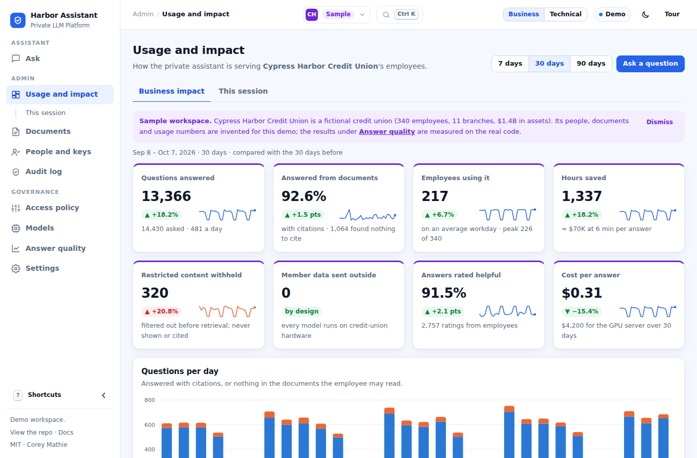

# Console

The console is the platform's user-facing surface: an employee assistant in front, with administration and
governance behind it. One set of static files serves two purposes. As a public demo it runs the gateway's own
Python modules in the browser against simulated services. As the operator console it is served by the gateway
at `/console/` and calls the real HTTP API. This document covers the two modes, the fictional business the demo
is set in, each screen, and how to run and publish the console.

## Two modes, one codebase

The console is one set of static files in [`demo/`](../demo/): `index.html`, `app.js`, `assistant.js`,
`screens.js`, `adapters.js`, `ui.js` and `styles.css`, with the shared navigation shell in `shell.js`. An
adapter selects the data source; the screens do not know which one is active.

| Mode | Adapter | Behaviour | Header label |
|---|---|---|---|
| **Demo** (GitHub Pages) | `DemoAdapter` | Loads Pyodide 0.26.4 and runs the gateway's own modules through `demo/engine.py`, with a simulated backend (hashed bag-of-words embeddings, extractive answers, a stand-in Ollama model inventory) | *Demo* |
| **Live** | `LiveAdapter` | The gateway serves the same files at `/console/`; the adapter calls its HTTP API with the admin key or token entered on Settings, held in memory, or in `sessionStorage` on request | *Live · connected to &lt;host&gt;* |

The mode comes from `GET ./api-mode` (a static file answers `demo`; the gateway answers `live`) or from
`?mode=demo|live`.

In demo mode the following gateway modules run in the browser through Pyodide: keys and rate limiting, roles
and permission-aware retrieval, citations, the audit hash chain, policy validation, model pinning, and the RAG
eval. Nothing leaves the page. There is no LLM in the browser; answers are extractive and labelled as
**simulated**.

## Sample business: Cypress Harbor Credit Union

The console is set in a sample business so that the platform can be assessed the way an institution would use
it. **Cypress Harbor Credit Union** is *fictional*: 340 employees in 11 departments, 11 branches in South
Florida, and one on-prem GPU server. The console opens on **Harbor Assistant**, the employee-facing chat, following the pattern
of an internal Copilot-style assistant; administration and governance sit behind it in the sidebar.

- **Library**: 59 documents in six collections (staff policies, member information, member services, lending,
  compliance, branch operations), each with an owner, department, version and review date (all within 12 months
  of the usage period). 46 come from [`scripts/sample_library.py`](../scripts/sample_library.py), which is also
  the single source for the department list, document owners and access rules (checked in CI). Member
  information (fees, hours, rates, how to join) is written for members and is readable by `group:public` and
  `group:staff`; every other collection is `group:staff` only. HR compensation (`group:hr`), the payments
  on-call runbook (`group:engineering`) and the BSA/AML escalation procedure (`group:compliance`) are restricted
  by document access list; front-line staff refer unusual activity under an all-staff referral policy.
- **People**: Priya Shah (Human resources), Dana Ortiz (IT and digital banking), Marcus Bell (Compliance and
  BSA, the BSA officer), Audrey Kim (Internal audit: `reader:*`, read-only across every collection, restricted
  documents still hidden, no free-form chat) and the branch lobby kiosk (an API key in `group:public`, so it
  reads Member information only). Suggested questions per person come from `demo/engine.py` and each is tested
  to cite the document it demonstrates; Audrey's salary-band suggestion is labelled as a refusal. The demo also
  creates two API keys: `member-faq-portal` (`group:public`) and `staff-intranet-search` (`group:staff`). API
  keys and the bootstrap admin appear in the technical view.
- **Usage**: 90 days from [`scripts/generate_sample_company.py`](../scripts/generate_sample_company.py),
  labelled **sample** everywhere, apart from **measured** results (Answer quality, Benchmarks) and the
  **simulated** requests made in the tab.

## Business and technical views

The header switch (or `?view=technical`) selects the audience. The business view shows what employees and
administrators see: plain-language access ("Restricted to the hr group"), document titles, and readable
audit-event names. The technical view adds retrieval scores and modes, API keys and token limits, raw
access-list entries, model digests, the lock file and ML-BOM, and the modules running in the tab. Light and
dark themes follow the system and can be switched in the header.

## Asking across every readable collection

*All sources I can read* (the default) searches every collection the person may read. The access decision
runs per collection before any passage is scored; passages are then ranked together. An answer quotes only
sentences from its best-matching document. A question that nothing in the library answers well receives
"I couldn't find that in the documents you can access" instead of an unrelated quote. This is a relevance
floor on vector similarity; the eval applies the same rule and reports how often it declines when it should.

## Navigation

Screens are grouped as Assistant, Admin and Governance, with breadcrumbs, a command palette
(<kbd>Ctrl</kbd>/<kbd>⌘</kbd> <kbd>K</kbd> or <kbd>/</kbd>), `g` + letter shortcuts (<kbd>?</kbd> lists them)
and a collapsible sidebar. A five-step guided tour runs on the first visit.



## Screens

| Screen | Function |
|---|---|
| Ask | Chat with streamed answers, numbered citations and source cards; a citation opens the document with the quoted passage highlighted, its owner, version, review date and who may read it. Conversation history, suggested questions per person, copy / ask again / helpful / not helpful, ask as someone else or compare two people side by side, search one collection or all. Technical view: retrieval mode, reranker, passage count, model-only chat (readers get 403) and a retrieval-details table per answer (scores, access rule, injection flags, audit line) |
| Usage and impact | For the sample credit union over 7, 30 or 90 days: questions answered, share answered from documents with citations, employees using it, hours saved and cost per answer (with stated assumptions), restricted content withheld, member data sent outside (zero), answers rated helpful, each against the previous period; questions per day; adoption by department; topics; response time; knowledge-base collections and who may read them; governance checks; recent activity |
| Usage and impact › This session | Requests, identities, collections and documents, audit status and access decisions for what was done in this tab; guided "what to try" cards |
| Documents | The library with titles, owners and review dates, a filter, add or upload, per-collection and per-document access lists, and a plain-language access matrix of who can read which document |
| People and keys | People and applications with their roles and groups; API keys with usage against the rate limit, burst test and revoke (technical view); SSO group-to-role mapping |
| Audit log | The hash-chained log with readable event names, filters, search and paging; each row opens a decision timeline (sign-in, access decision, retrieval, sources, answer, hashes). "Log intact" check; demo mode adds a tamper-detection test |
| Access policy | The policy in effect, in plain language, then the runtime policy as JSON, validated with the gateway's own types and `identity.check_role`, applied and audited, with a "try a change" scenario before and after |
| Models | Backend health, served models, off/warn/enforce policy; the technical view adds digests, lock-file verification and validation, and ML-BOM model components |
| Answer quality | The `scripts/rag_eval.py` scorecard per configuration against `evals/thresholds.json`, measured on the Cypress Harbor library itself with 59 questions asked as the five people (including questions to decline), and the questions not answered perfectly with who asked them; demo mode re-runs the eval in the browser and compares |
| Settings | Mode, credential (live), modules running in the tab (technical view), and what is simulated |

## Running the console against the gateway

```bash
docker compose up        # then open http://localhost:8080/console/
docker compose logs gateway | grep "Bootstrap admin"     # the admin key to paste on Settings
```

That stack needs no model or GPU. The gateway talks to `mock-llm`, which is
[`scripts/mock_openai_server.py`](../scripts/mock_openai_server.py) in **simulated** mode (extractive answers,
hashed embeddings; not a language model). *Load sample data* on Usage and impact › This session adds the sample
library, each collection's access list and three keys (`hr-assistant` and `eng-assistant` in `group:staff`,
`lobby-kiosk` in `group:public`) through the API.

For real answers, Ollama remains the default backend:
`docker compose --env-file profiles/compose-ollama.env --profile ollama up -d`, then pull `llama3.1:8b` and
`nomic-embed-text` (see the top of `docker-compose.yml`). The earlier single-file admin page is still served at
`/admin`.

## Console endpoints

The console added these endpoints, all admin-only: `GET /admin/overview`, `GET /admin/audit/entries`,
`GET /admin/access-matrix?collection=`, `GET /admin/policy`, `POST /admin/policy/validate`,
`PUT /admin/policy` (in memory, audited as `policy_changed`; a restart reads the environment again),
`GET /admin/rate-limits`, `POST /admin/models/lock/validate` and `GET /admin/models/mlbom`. In addition,
`GET /console/api-mode` and per-request `retrieval_mode` / `reranker` on `/ask`.

## Verification

The browser engine runs under CPython in the test suite (`tests/test_demo_engine.py`,
`tests/test_console_engine.py`). `scripts/demo_smoke.py` drives the real console headlessly with Playwright in
both modes: every screen and its key interaction in demo mode, then the gateway and the simulated backend under
uvicorn in live mode (41 checks, no console errors, no horizontal scroll at 390 px). See
[testing.md](testing.md).

## Publishing the demo

Enable GitHub Pages for the repository (Settings → Pages → deploy from the `main` branch, root folder). The
console is then at `https://coreymathie.github.io/private-llm-platform/demo/`. `.nojekyll` makes Pages serve the
Python files as-is.
